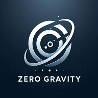
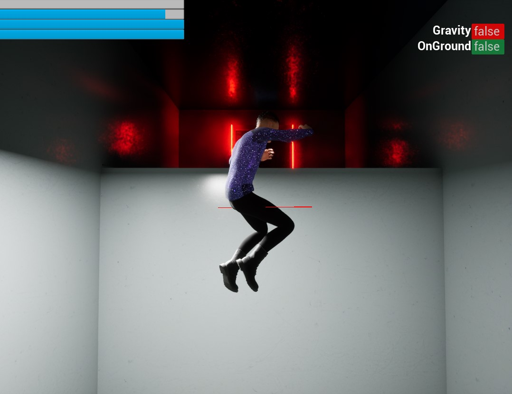
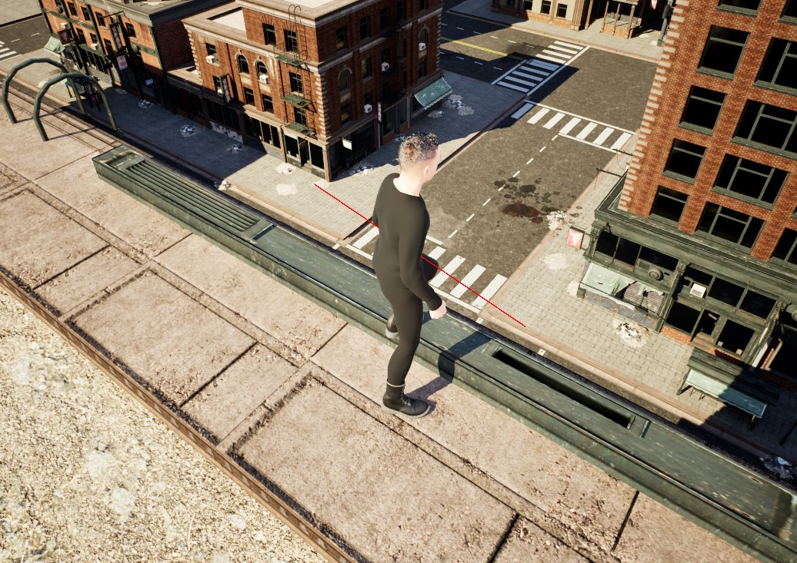

# ZeroG

  
  by Karl Lilje

## Overview
[Watch ZeroG gameplay demo on YouTube](https://www.youtube.com/watch?v=kBvnNHt50HY)
  




**ZeroG** is an Unreal Engine-powered puzzle game where you play as a young man with the extraordinary ability to defy gravity. Use your powers to navigate challenging environments, solve intricate puzzles, and uncover the mysteries behind your unique gift.

## Features

- **Gravity Manipulation:** Change your orientation and walk on walls or ceilings.
- **Physics-Based Puzzles:** Interact with objects and environments in creative ways.
- **Immersive Story:** Discover the origins of your powers and the world around you.
- **Stunning Visuals:** Built with Unreal Engine for high-quality graphics and effects.

## Getting Started

1. Clone the repository:
    ```bash
    git clone https://github.com/BigFun123/ZeroG.git
    ```
2. Open the project in Unreal Engine.
3. Press Play to start exploring ZeroG!

## Contributing

We welcome contributions! Please submit issues or pull requests to help improve the game.

## License

This project is licensed under the MIT License.

---